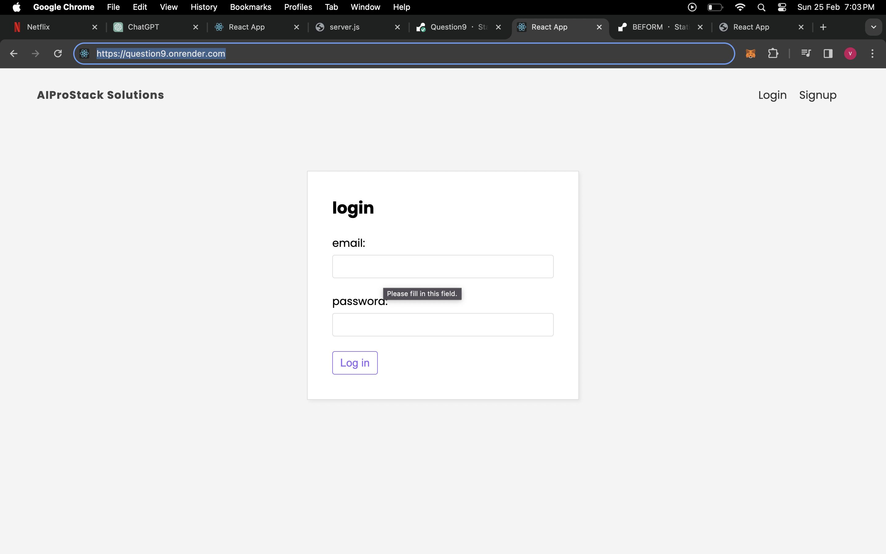
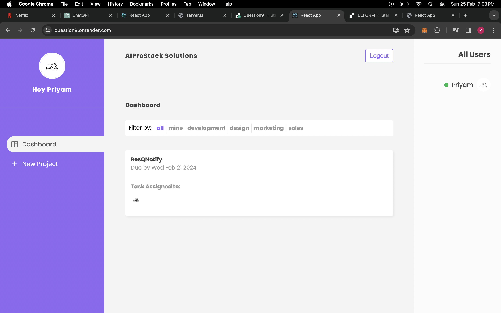
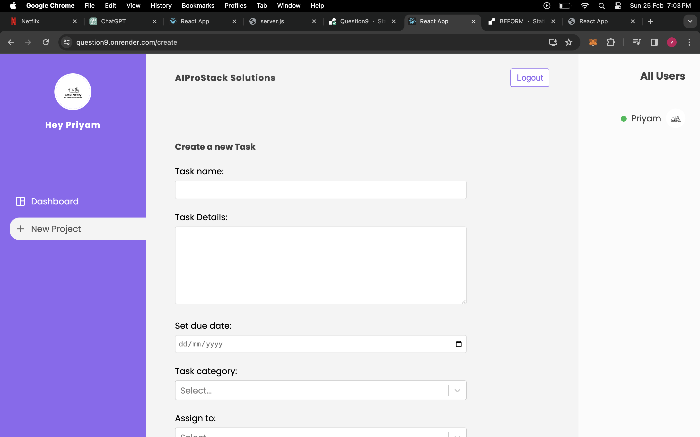

# Express Authentication Example

This is an example to build a collaborative task management application. Users are allowed to create tasks, assign them to team members, set due dates, and track progress. User authentication and authorization is implemented.

## Hosted Website 
You can see the hosted website on https://question9.onrender.com/







## Installation

To run this project, you will need Node.js and npm installed on your machine.

1. Clone the repository to your local machine.
2. Navigate to the project directory and install dependencies:

    ```bash
    npm install
    ```

3. Start the server:

    ```bash
    npm run start
    ```

## Usage

Once the server is running, you can access the application by visiting `http://localhost:3000` in your web browser.

## Features

- Frontend application made in react, with backend as firebase
- Real time updation of user data using Firebase realtime database
- User authentication implemented
- Email/Password Signup & Login functionality 

## Important

This is a demonstration only. In a real application, replace the example user database with a proper database solution.
